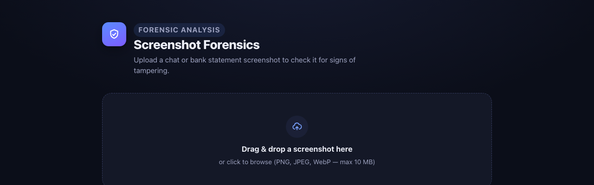
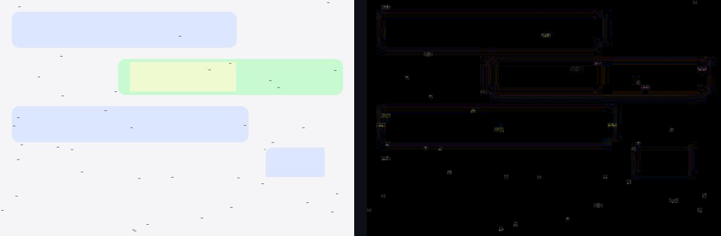

# Screenshot Forensics — Working MVP

A runnable implementation of the fake-screenshot detector described in the
design doc — chat apps, bank statements, social media posts, or arbitrary
images passed off as a screenshot: a Flask backend performing Error Level
Analysis (ELA) plus complementary forensic checks, and a React frontend for
upload and results. This is a **scoped-down MVP**, not the full 6-month
production system — see "What's implemented" and "What's not" below before
treating its verdicts as authoritative.



**Example output** — a synthetically tampered chat screenshot (generated by
`backend/tests/conftest.py`'s test fixture) run through `/analyze`. The ELA
heatmap on the right highlights the recompressed patch as a bright block; the
composite `fake_score` here is a synthetic-corpus example, not a real-world
tampered screenshot:



## What's implemented

- **ELA** (`backend/forensic.py::compute_ela` / `ela_feature_score`) —
  recompresses the image and diffs it against the original. Hotspot
  detection compares each block against its own *local neighborhood*
  (robust MAD-based z-score), not a whole-image threshold — this avoids
  conflating "block has real content" with "block was tampered", which a
  global threshold cannot distinguish on mostly-flat UI screenshots.
- **JPEG Ghost (multi-quality recompression scan)** (`compute_jpeg_ghost`)
  — recompresses the image across a range of candidate qualities and looks
  for blocks whose recompression-error curve dips at a different quality
  than the rest of the image (Farid's JPEG Ghost method), the classic
  signature of a region edited and re-saved at a different generation than
  its surroundings. **Computed and shown in the per-cue breakdown, but
  intentionally excluded from `fake_score`** — calibration testing (see
  below) showed it unreliable on flat/vector-UI content, sometimes scoring
  an *untouched* image higher than its tampered counterpart. Kept visible
  for transparency/debugging, not because it's trusted.
- **JPEG quantization table check** — flags images with more compression
  tables than a single JPEG encode should have (kept as a minor, low-weight
  legacy signal; rarely fires in practice since most re-encoders still only
  emit two tables).
- **EXIF/metadata check** — flags editing-tool software tags (weighted
  heavily — this is close to a smoking gun), camera EXIF on a "screenshot",
  and GPS data. One of the two most reliable cues in this pipeline.
- **Document text check (OCR)** (`check_document_text`) — extracts the
  image's actual text (via Tesseract) and flags known fake-statement/
  fake-document generator watermarks (e.g. a site brand printed on the
  document) and placeholder data (generic names like "John Doe", obviously
  sequential/repeated-digit account numbers). This is the other most
  reliable cue: pixel-level forensics (ELA, noise, clone detection) cannot
  see *what the document says*, only how its bytes were compressed — and a
  real-world test case (see "Known limitations") showed that gap matters:
  a fake bank statement carrying a generator's own watermark read as
  "Likely Authentic" on pixel evidence alone.
- **Block-wise noise consistency check** — flags local-neighborhood noise
  outliers (same rationale as ELA above) plus overall coefficient of
  variation across blocks.
- **Copy-move (clone) detector** (`detect_clone_regions`) — rewritten to use
  offset-vector voting (Fridrich/Popescu-style block matching): near-duplicate
  blocks that are spatially far apart vote for the displacement vector
  between them, and a genuine copy-paste produces one dominant, spatially
  *compact* peak (many blocks agreeing on the same offset, clustered in one
  area). This replaces the old "any two blocks share a hash" approach, which
  couldn't tell a real rigid copy-move apart from coincidentally-similar
  repeated UI elements (icons, bullet points) scattered around the frame.
- **Screenshot-specific rendering cues** (`backend/forensic.py`, "Screenshot-
  specific rendering cues" section) — four newer cues specific to *rendered
  UI* rather than photograph forensics, added and empirically calibrated the
  same way every cue above was (implement, test against real synthetic
  screenshots, keep only what the evidence supports):
  - **Amount consistency** (`check_amount_consistency` → `arithmetic_score`)
    — flags a document whose own printed numbers contradict each other (a
    Total less than its Subtotal, or the same Total/Balance label printed
    twice with different values) — mathematically impossible for a real
    document, so this is near-conclusive once it fires, the same tier as
    `text_score`. **Validated**: true-positive and true-negative tested
    directly, weighted in `config.WEIGHTS` and included in
    `config.OVERRIDE_CUES` at the same 0.8 bar as metadata/text.
  - **Chrome/status-bar consistency** (`check_chrome_consistency` →
    `chrome_score`) — flags a phone-shaped screenshot's status-bar clock
    reading being repeated verbatim elsewhere in the image (a
    screenshot-of-a-screenshot or composited device chrome). **Validated**
    after an early version was found (via calibration) to false-positive on
    any ordinary receipt/payment timestamp outside the status bar — fixed
    to require an *exact* duplicate of the status-bar reading specifically,
    not just any clock-shaped text. Score capped at 0.6 (below override
    territory) given the narrower validation; low weight in `WEIGHTS`.
  - **Font rendering consistency** (`check_font_consistency` → `font_score`)
    — intended to flag text rendered with different anti-aliasing than the
    rest of the document (a paste from a different rendering source).
    **NOT validated** — direct testing with a deliberately constructed
    mismatch (normal text next to a hard-thresholded, anti-aliasing-free
    copy) could not get this cue to fire; either Pillow's bundled default
    font doesn't carry enough anti-aliasing at typical sizes, or the
    edge-steepness metric itself isn't sensitive enough. Computed and shown
    for transparency, excluded from scoring — see the function's docstring.
  - **Edge/resampling sharpness consistency** (`check_edge_sharpness_consistency`
    → `edge_score`) — intended to flag a region resampled at a different
    scale than its surroundings (interpolation blur). **Tested and found
    NOT reliable** — saturates near the top of its range on ordinary,
    untampered screenshots across every category tried, and did not
    increase (in one test, slightly decreased) against a genuine resampled
    patch. Same fate as JPEG Ghost, for a related reason: flat UI content
    has legitimately wide local variance in edge sharpness (a vector card
    border next to a soft shadow next to dense text), so "local outlier"
    fires on ordinary layout structure, not just tampering. Computed and
    shown, excluded from scoring.

  All four cues share OCR data with `check_document_text` via one internal
  Tesseract pass (`forensic._ocr_data`) rather than each running its own,
  and each still accepts a plain image directly (computing OCR itself if
  not given precomputed data), so they stay independently callable/testable
  like every other cue in this module.
- **Per-domain threshold classification** (`classify_content_type` →
  `meta.content_type`) — a simple, explainable, rule-based bucketing (not a
  second trained model) into `financial_document` / `social_or_chat` /
  `photo` / `unknown`, used to look up a per-type threshold override
  (`config.CONTENT_TYPE_THRESHOLDS`) instead of always using the one global
  `FAKE_THRESHOLD`. Directly motivated by this project's own measured
  finding (see "Trained model" below): the same threshold that gives
  CASIA's general photos 100% recall gives findit2's dense receipts only
  28% precision, because one cutoff can't suit a nearly-textless photo and
  a dense financial document equally well. `financial_document` is raised
  to 0.55 for that reason; a misclassification here only shifts which
  threshold applies, never `fake_score` itself, so it degrades gracefully.
  This is a reasoned first pass based on the one breakdown available, not
  an independently threshold-swept value — see the config for the honest
  caveat on that.
- **Trained classifier** (`backend/model_loader.py`) — a RandomForest
  trained on three real, labeled forgery datasets pooled together (see
  "Trained model" below for composition, measured accuracy, and honest
  domain-gap caveats), loaded from `backend/model_data/rf_model.joblib` and
  preferred over the transparent weighted-average heuristic
  (`predict_fake_heuristic`, kept as a fallback for environments without a
  bundled model or scikit-learn). `model_loader.MODEL_NAME` is read from
  `rf_model_meta.json`'s `model_description` field rather than hardcoded, so
  it always reflects whatever dataset the currently-loaded model was
  actually trained on. The heuristic's weights were themselves reweighted
  based on calibration testing against a synthetic corpus (see
  `backend/tools/calibrate.py`) rather than the original arbitrary weights —
  metadata and document-text carry the most weight since they're the two
  cues testing could actually validate as reliable.
- **High-confidence override** (`config.OVERRIDE_CUES`, applied in
  `predict_fake` on top of *either* classifier above) — even a trained
  model can fail to weight a rare-but-conclusive signal correctly (see
  "Trained model" below — the model's own probability sometimes undershoots
  on exactly the cases that matter). A cue that's genuinely conclusive on
  its own (an editing-tool EXIF tag, an OCR-caught generator watermark) can
  get diluted or under-weighted; if `metadata_score` or `text_score`
  individually clears a high bar (0.8), the verdict is forced to "fake"
  regardless of the composite score — the composite `fake_score` is still
  reported unmodified, and the API/UI both surface *why* (`override_reason`)
  so this never happens silently. This exists because of a concrete false
  negative found in
  manual testing (see "Known limitations").
- **Flask API** (`/analyze`, `/status`) — images processed in memory only,
  never written to disk; SHA-256 logged for traceability, not the image
  itself.
- **React frontend** — drag-and-drop upload, ELA heatmap + original
  side-by-side, per-cue breakdown with suspicion scores, JSON report
  download.
- **Tests** — backend pytest tests (unit tests per forensic cue + API
  integration tests + an accuracy regression test using the tamper type
  proven reliable) and frontend vitest tests, all passing.
- **Docker** — Dockerfiles for both services + `docker-compose.yml` (nginx
  reverse-proxies `/api/*` to the Flask container).

## What's NOT implemented (out of scope for this MVP)

The design doc describes a 6-month, multi-person project. These pieces are
explicitly **not** built here, and would need real work to add:

- **No CNN / deep-learning model.** A RandomForestClassifier over the seven
  cue scores is now trained and bundled (see "What's implemented" and
  "Known limitations" below) — this is real progress over the original
  MVP's pure heuristic, but it's still a shallow model over hand-crafted
  features, not the CNN-on-ELA-image "hybrid" approach the design doc's
  model-comparison table describes as the strongest option.
- **No screenshot-specific labeled dataset.** No public dataset of labeled
  real/fake chat or bank-statement *screenshots* exists, so the trained
  model is built from three real (not synthetic) labeled forgery datasets
  from adjacent domains instead — see "Trained model" below for what they
  are and the honest domain-gap caveats that come with that substitution.
  `tools/synthesize_dataset.py` now generates a procedural corpus across
  five screenshot categories (chat, bank, payment, social, ecommerce) that
  `tools/train_model.py --synthetic` can pool in — see "Synthetic screenshot
  corpus" below — but this is still procedurally generated, not real-world
  data, so it narrows the gap rather than closing it.
- **No PRNU sensor-noise analysis** (the doc itself notes this doesn't
  apply to screenshots).
- **No font/subpixel or GAN-fingerprint analysis.**
- **No cloud deployment, autoscaling, CI/CD, or Prometheus/Grafana
  monitoring** — just local Docker Compose.
- **No auth, rate limiting, or HTTPS termination** — add a reverse proxy
  (e.g. Caddy/Traefik) with TLS before exposing this beyond localhost.

## Known limitations of the heuristic

- Scores are **not calibrated against real-world ground truth** — there is
  no labeled dataset of actual forged screenshots in this repo. The weights
  in `config.py` were calibrated against a *synthetic* corpus generated by
  `backend/tools/calibrate.py` (paired authentic/tampered images across
  several tamper types), which is the best available substitute, but it is
  not a real-world validation. Treat `fake_score` as a rough, explainable
  signal, not a probability.
- **Measured, reproducible behavior against that synthetic corpus** (run
  `python3 tools/calibrate.py` inside the backend container to reproduce):
  editing-tool EXIF fingerprints are caught **reliably (100%)**, and
  authentic images are **never** false-flagged (0% false-positive rate).
  Recompressed-patch edits, copy-move duplication, and flat/low-texture
  overwrites are caught only some of the time — compression- and
  noise-artifact analysis (ELA, JPEG Ghost, block noise) turned out to be
  **much weaker signals on flat, mostly-vector UI screenshots than on
  natural photographs**, where these classical forensic techniques were
  originally developed and validated. This is a genuine, currently-unsolved
  gap, not a hidden one — see `backend/tools/calibrate.py` to reproduce or
  extend the calibration corpus.
- JPEG Ghost (multi-quality recompression scan) is implemented and
  documented above, but testing showed it unreliable on this content type
  specifically (see note above) — it's excluded from `fake_score` for that
  reason, not included and silently trusted.
- Screenshots legitimately contain repeated UI elements (icons, rounded
  corners, bullet points). The clone detector's offset-voting approach
  specifically targets this: a real copy-paste produces one dominant,
  spatially compact displacement vector, while coincidentally-similar
  repeated elements spread their matches across many different vectors and
  a larger area. Dense, regularly-spaced decorative content (e.g. a strict
  grid of identical icons) can still produce false peaks — this remains a
  real risk, just a narrower one than before.
- ELA and JPEG Ghost are weak against images that were **never
  JPEG-compressed** at all (e.g. a PNG screenshot with no compression
  artifacts to diff) or that were **uniformly** re-saved as a whole (no
  localized hotspot).
- **Real-world false negative found in manual testing, now fixed**: a fake
  bank statement (from an actual fake-statement-generator site, carrying
  that site's own watermark and placeholder customer/account data) scored
  "Likely Authentic" — its pixel-level cues weren't remarkable for a dense,
  text-heavy document, so the composite weighted score stayed low despite
  the document being trivially identifiable as fake *by reading it*. This
  is why the OCR-based document-text check and the high-confidence
  override exist (see "What's implemented" above): pixel forensics alone
  cannot see watermarks or placeholder data, and a plain weighted average
  can dilute even a conclusive single signal below threshold. This also
  means OCR quality (font size, resolution, contrast) directly affects
  reliability of this specific cue — a blurry or very low-resolution photo
  of a statement may not OCR cleanly enough to catch a watermark that a
  clean screenshot would.
- **Two of the four newer screenshot-specific cues didn't hold up under the
  same empirical bar the cues above were held to.** `font_score` could not
  be shown to fire on a deliberately constructed rendering mismatch;
  `edge_score` saturates on ordinary untampered screenshots regardless of
  content and didn't respond to a genuine resampling tamper in direct
  testing. Both are computed and returned by the API for transparency
  (same treatment as `ghost_score`) but excluded from `fake_score` — see
  their docstrings in `forensic.py` for exactly what was tried. The other
  two (`chrome_score`, `arithmetic_score`) passed true-positive/true-
  negative testing and are scored, though `chrome_score` has a known,
  narrower false-positive mode (see its docstring) that capped its weight
  and kept it out of `OVERRIDE_CUES`.

## Running locally (without Docker)

Backend (requires the `tesseract-ocr` system package for the document-text
cue — `apt-get install tesseract-ocr` / `brew install tesseract`; without it,
that cue degrades gracefully to a 0 score rather than failing the request):
```bash
cd backend
python3 -m venv venv && source venv/bin/activate
pip install -r requirements.txt
python app.py            # serves on http://localhost:5000
```

Run backend tests:
```bash
cd backend
pytest tests/ -v
```

Frontend:
```bash
cd frontend
npm install
npm run dev               # serves on http://localhost:5173, proxies /api -> :5000
```

Run frontend tests:
```bash
cd frontend
npm test
```

## Running with Docker Compose

```bash
docker compose up --build
```
- Frontend: http://localhost:8080
- Backend API directly: http://localhost:5050 (mapped from container port 5000 —
  remapped from the default 5000 because that port is taken by macOS's
  AirPlay Receiver/ControlCenter on many Macs; change it back in
  `docker-compose.yml` if that doesn't apply to you)

## API

`POST /analyze` — multipart/form-data, field `image` (png/jpg/jpeg/webp, ≤10MB).

Response — captured live from a real request against a synthetic
watermark-injected bank-statement image (`docker compose up` then
`curl -F image=@... localhost:5050/analyze`), trimmed for brevity:
```json
{
  "fake_score": 0.1652,
  "is_fake": true,
  "verdict": "Possible Fake",
  "override_reason": "text_score",
  "ela_image": "data:image/png;base64,...",
  "features": {
    "ela_score": 0.8972, "ghost_score": 0.0, "quant_score": 0.0, "noise_score": 0.7949,
    "clone_score": 0.2022, "metadata_score": 0.0, "text_score": 0.9,
    "font_score": 0.0, "edge_score": 0.8603, "chrome_score": 0.0, "arithmetic_score": 0.0
  },
  "details": {
    "ela": {...}, "jpeg_ghost": {...}, "quantization": {...}, "metadata": {...}, "noise": {...},
    "clone_detection": {...}, "document_text": {...}, "font_consistency": {...},
    "edge_sharpness": {...}, "chrome_consistency": {...}, "amount_consistency": {...}
  },
  "meta": {
    "original_format": "JPEG", "sha256": "...", "processing_ms": 219.3,
    "content_type": "financial_document", "effective_threshold": 0.55,
    "model": "randomforest-v2 (trained on findit2 + casia2 + imd2020 — see README's 'Trained model' section for composition and caveats) + high-confidence overrides"
  }
}
```
Notes:
- `features`/`fake_score` intentionally omit `ghost_score`, `font_score`,
  and `edge_score` from the weighted combination (see "Known limitations"
  and "What's implemented" above for why each was excluded) even though
  their `details` entries are always present in the response for
  transparency.
- `override_reason` is `null` unless a high-confidence override cue
  (`metadata_score`, `text_score`, or `arithmetic_score`) fired on its own
  — see `config.OVERRIDE_CUES`. The example above shows exactly that case:
  ELA/noise were elevated (a dense document, not necessarily tampering) and
  metadata/arithmetic were clean, so the composite `fake_score` (0.1652,
  well under even the default 0.5) would round down to "authentic" — but
  the OCR cue caught a placeholder account number, which alone is
  conclusive enough to override.
- `meta.content_type`/`meta.effective_threshold` show which per-domain
  threshold was actually used for the `is_fake` decision — see
  `classify_content_type` above. This example was classified
  `financial_document`, so 0.55 was the bar (not that it mattered here,
  since the override fired regardless).

`GET /status` — health check.

## Trained model (done) / upgrading it further

`backend/model_loader.py` loads `backend/model_data/rf_model.joblib` — a
RandomForestClassifier — at import time if present, and prefers it over the
weighted-average heuristic (`predict_fake_heuristic`, kept as the fallback
when no model is bundled or scikit-learn/joblib aren't installed). It was
trained via `backend/tools/train_model.py` on **three real, labeled
image-forgery datasets pooled together** — broadening beyond one narrow
document type was the explicit goal of this retrain, since the project now
covers fake screenshots in general, not just bank statements:

- **"Find it again!"** (ICDAR 2023, L3i lab, Univ. of La Rochelle:
  https://l3i-share.univ-lr.fr/2023Finditagain/) — 987 scanned receipts, 162
  forged (copy-paste, text imitation, deletion, pixel edits). The original
  document-domain dataset this project started with.
- **CASIA v2.0** — the classical image-forensics benchmark: 3,000 general
  photographs sampled (1,500/class, from 12,614 total) across categories
  like animals, architecture, nature, and indoor scenes, half spliced or
  copy-moved. Broadens training to arbitrary photographic content, not just
  documents.
- **IMD2020 "real-life" set** (Novozámský et al., WACVW 2020) — 2,424
  images (414 authentic + 2,010 manipulated) that are *genuine forgeries
  found online*, made and shared by unknown people rather than generated in
  a lab. This is the closest available analogue to "someone faked a
  screenshot and posted it," and the best proxy this project has for
  real-world validation.

Datasets without a pre-defined split (CASIA v2, IMD2020) get one created
per-class (70/15/15, seeded) before pooling with findit2's own split, so no
single dataset dominates train/val/test proportions.

**Measured performance** (RandomForest, `n_estimators=300`,
`class_weight="balanced"`, `max_depth=6`, on a pooled held-out test split of
1,033 images, 562 forged):

| | Old heuristic | Old RF (findit2 only) | Current RF (pooled) |
|---|---|---|---|
| Precision | 42.3% | 100% (findit2 test) | **79.1%** |
| Recall | 31.4% | 28.6% (findit2 test) | **79.4%** |
| F1 | 0.361 | 0.444 (findit2 test) | **0.792** |

Per-source-dataset breakdown on the same pooled test split (this is the
number that matters more than the pooled average — a regression on one
domain can hide behind a good overall number):

| Dataset | n | Precision | Recall | F1 |
|---|---|---|---|---|
| casia2 (general photos) | 450 | 90.7% | **100%** | 0.951 |
| imd2020 (real-world found forgeries) | 365 | 82.0% | 66.6% | 0.735 |
| findit2 (receipts) | 218 | 28.2% | 57.1% | 0.377 |

**Feature importances**: `metadata_score` dominates (0.505), followed by
`ela_score` (0.243), `noise_score` (0.126), `clone_score` (0.074),
`ghost_score` (0.033), `text_score` (0.019), `quant_score` (~0).

Honest caveats from this retrain:
- **Broadening the dataset traded receipt-specific precision for general
  recall.** The old findit2-only model scored 100% precision / 28.6% recall
  on receipts; the new pooled model scores 28.2% precision / 57.1% recall on
  the *same* receipt test set — recall roughly doubled, but precision
  dropped sharply, because the model now shares one global threshold across
  visually very different domains (dense text documents vs. natural
  photos vs. arbitrary found images) instead of specializing on receipts.
  Document-type screenshots may see more false positives as a result — the
  `text_score` high-confidence override (`config.OVERRIDE_CUES`) matters
  more than ever here, since `text_score` itself now carries low pooled
  feature importance (0.019) despite being one of the two most reliable
  cues specifically *for* document content (see "Known limitations").
- **`metadata_score`'s dominance is a real, plausible signal, not a
  training artifact** — CASIA's tampered images were genuinely edited in
  tools like Photoshop/GIMP, which stamp the same `Software` EXIF tag this
  cue was designed to catch on faked screenshots, and CASIA's near-perfect
  100% recall reflects that shared signal rather than a domain mismatch.
  But it does mean a forged image edited *without* leaving that fingerprint
  (or one where EXIF was stripped) leans more heavily on the other, weaker
  cues.
- **imd2020's numbers (82% precision, 67% recall) are this project's best
  available proxy for real-world "faked and shared" content** — closer to
  the actual target use case than either lab-generated dataset — but it's
  still 2,424 images from one source (Reddit-style "spot the edit" threads),
  not a general screenshot benchmark.
- No public labeled dataset of actual fake chat/bank-statement/social-media
  *screenshots* still exists (see "What's NOT implemented") — this remains
  a real, documented domain gap, just a narrower one than before.

To retrain (e.g. with more data, different dataset caps, or a future
screenshot-specific dataset):
```bash
# Extract findit2 (train.txt/val.txt/test.txt CSV + train/val/test image
# folders), CASIA2.0_revised (Au/ and Tp/ folders), and/or IMD2020 (one
# subdirectory per example, <name>_orig.<ext> = authentic) locally, then:
docker compose run --rm \
  -v /path/to/findit2:/data/findit2 \
  -v /path/to/CASIA2.0_revised:/data/casia2 \
  -v /path/to/IMD2020:/data/imd2020 \
  backend python3 tools/train_model.py \
    --findit2 /data/findit2 --casia2 /data/casia2 --imd2020 /data/imd2020
```
Any subset of `--findit2`/`--casia2`/`--imd2020`/`--synthetic` (see below)
may be passed. `--casia-cap` (default 1500/class) controls how much of
CASIA's much-larger pool gets sampled, to keep feature-extraction time
bounded. This overwrites `backend/model_data/rf_model.joblib` and
`rf_model_meta.json` in place (the latter records dataset composition and
the human-readable description `model_loader.py` surfaces as `MODEL_NAME`);
restart the backend container to pick it up. Pass `--model-dir` to write
somewhere else instead — useful for a test/demo retrain (e.g.
synthetic-only) you don't want to overwrite the real bundled model with.
`backend/tools/calibrate.py` (the synthetic-corpus calibration tool from
before any trained model existed) still works and now reports the *trained
model's* behavior on that corpus too, useful as a quick sanity check
between retrains.

### Synthetic screenshot corpus

`backend/tools/synthesize_dataset.py` procedurally generates a labeled,
paired authentic/tampered corpus across **eight screenshot categories** —
`chat`, `bank`, `payment`, `social`, `ecommerce`, `email`, `notification`,
`crypto` — specifically to narrow the "no screenshot-specific labeled
dataset" gap above (see that file's docstring for the full design). Each
authentic render uses real, OCR-legible text (`ImageDraw.text` + Pillow's
bundled scalable font, no system-font dependency, so it works identically
on macOS and the `python:3.10-slim` backend image), independently rolls a
light or dark color palette, and `chat` sometimes renders as a group thread
(multi-name header, per-message sender labels) instead of 1:1. Each
authentic image gets one paired tamper drawn from six types:
patch-recompress, copy-move, flat-overwrite, an editing-tool EXIF tag, a
generator-watermark/placeholder-data injection (reuses
`forensic._GENERATOR_WATERMARKS`/`_PLACEHOLDER_NAMES` directly, so it
always matches what `check_document_text` actually looks for), and a
combined patch+EXIF case. Authentic images also sometimes get a second,
content-preserving resave pass (simulating re-sharing through another app)
so the model isn't taught that recompression alone means "fake". Known
scope limit, stated in the tool's own docstring: every category still
shares one rendering engine, so this corpus narrows the "no screenshot
dataset" gap, it does not close it — see "Suggested next steps" below for
what closing it further would take.

```bash
python3 tools/synthesize_dataset.py --out /data/synthetic --count 150
# then pool it into a retrain like any other source:
python3 tools/train_model.py --synthetic /data/synthetic \
  --findit2 /data/findit2 --casia2 /data/casia2 --imd2020 /data/imd2020
```

**Measured, reproducible on a synthetic-only demo retrain** (2,400 images,
150/category across all 8 categories, `--synthetic` alone, held-out test
split n=368): precision 99.0%, recall 54.4%, F1 0.702 — consistent with the
5-category version of this same experiment (98.4%/53.9%/0.697), a good sign
the pipeline's behavior doesn't degrade as categories are added. Near-zero
false positives on authentic synthetic screenshots; only about half of
tampered ones caught, split unevenly by tamper type (metadata- and
text-based tampers are caught reliably; patch-recompress and copy-move are
the weak spots, consistent with "Known limitations" above). Per-category
F1 ranges narrowly (0.51–0.72 test set) — no single new category (email,
notification, crypto) stood out as dramatically easier or harder than the
original five. `metadata_score` (0.517) and `text_score` (0.229) still
dominate feature importance; of the four new cues, `edge_score` picked up
some importance (0.060) despite direct testing finding it doesn't
discriminate reliably (see "What's implemented" above) — treat that
specific number with skepticism rather than as validation, since one
training run's importance score isn't the same evidence as a direct
true-positive/true-negative test. `chrome_score`/`arithmetic_score` scored
**zero** importance in this run for an explainable reason, not because
they don't work: none of the six tamper types above happen to construct a
duplicated-clock or contradictory-total scenario, so those two features
have no variance in this training set for the model to learn from yet — a
concrete, named gap for a future tamper type to close (see "Suggested next
steps").

**This synthetic corpus has not been pooled into the bundled production
model** (`backend/model_data/rf_model.joblib` is still findit2+casia2+imd2020
only, and `rf_model_meta.json`'s `feature_keys` still lists the original
seven — the four new cues are computed and returned by the API for every
request regardless, just not yet seen by the trained model's own
probability estimate) — that's a deliberate choice, not an oversight.
Procedurally generated data risks teaching the model to recognize *this
generator's own* rendering quirks rather than universal tampering signal,
which would be invisible in an evaluation against more of the same
generator's output. Doing this responsibly means validating on real
screenshots (even a small hand-collected set — see "Real-world validation"
below) before trusting a synthetic-inclusive model, and capping synthetic
data's share of the pooled training set rather than letting it dominate.
Treat `--synthetic` as a way to close specific, named gaps (a category or
tamper type real datasets don't cover) alongside real data, not a
replacement for it.

### Real-world validation

Every accuracy number anywhere else in this README — `calibrate.py`,
`train_model.py`'s reports, the synthetic-corpus retrain above — comes from
either a procedurally generated corpus or adjacent-domain datasets
(receipts/general-photos/found-forgeries), never from confirmed-real vs.
confirmed-fake *screenshots*. `backend/tools/evaluate_manual.py` is the
tool for that missing step, and deliberately does not try to substitute for
it with generated data — fabricating "real-world" fake screenshots and
presenting them as real-world validation would be exactly the kind of
misleading content this project's own honesty about its limitations argues
against throughout. It just makes it cheap to get a real number the moment
anyone has even a small folder of genuine, personally-verified examples:

```bash
python3 tools/evaluate_manual.py \
  --authentic-dir /path/to/confirmed_real_screenshots \
  --fake-dir /path/to/confirmed_fake_screenshots
```

Reports accuracy/precision/recall/F1 in the same shape as
`train_model.py`'s per-source breakdown, plus every misclassified filename
with its score and detected content type. Either flag may be omitted (e.g.
to just check the false-positive rate against your own real screenshots).
No results are reported here because no such folder has been assembled yet
— this is intentionally left as a real gap, not filled with a number that
would look like validation without being any.

### Suggested next steps

Concrete, scoped follow-ups this session's work surfaced — named here
rather than left implicit, so "what's next" doesn't have to be
re-derived from scratch:

- **A tamper type that exercises `chrome_score`/`arithmetic_score` during
  training.** Both cues are validated (direct true-positive/true-negative
  tests pass) but scored zero feature importance in the retrain above
  because none of the six existing tamper types construct a duplicated-
  clock or contradictory-total scenario — add a 7th tamper type that does,
  so the trained model can actually learn to use them.
- **A genuine cross-renderer test for `font_score`.** This session's
  attempt to validate it used Pillow's own font hard-thresholded as a proxy
  for "different rendering source", which didn't produce a measurable
  difference — a real test needs text actually rasterized by two different
  engines (e.g. a real TTF via Pillow vs. a browser/canvas render of the
  same string) before this cue can be trusted or discarded with confidence.
- **A different approach for `edge_score`**, if pursued further: local
  outlier detection over block-wise edge sharpness saturates on ordinary
  UI layout structure. Explicit periodic-artifact detection for resampling
  (closer to the classical Popescu-Farid method) is a more promising
  direction than tuning the current approach's thresholds further.
- **A properly threshold-swept `CONTENT_TYPE_THRESHOLDS`.** The current
  0.55 for `financial_document` is a reasoned first pass based on one
  measured breakdown (findit2's precision problem), not derived from a
  precision-recall sweep per bucket — worth revisiting once more
  category-labeled data (synthetic or real) exists to sweep against.
- **A real, hand-collected validation set** — see "Real-world validation"
  directly above; this is the highest-leverage single gap remaining, since
  every other number in this README is a substitute for it.
- **New categories/layout diversity in `synthesize_dataset.py`** —
  localization, additional aspect ratios, and a genuinely held-out
  rendering-style split (train on one visual variant per category, evaluate
  on a distinct one) to measure generalization rather than only
  content-random splits, were scoped but not built this round.

## Project structure

```
fake-screenshot-detector/
  backend/
    app.py            # Flask routes
    forensic.py        # ELA, JPEG ghost, OCR/document-text, metadata, quantization, noise, clone
                        # detection, screenshot-specific cues, content-type classification, pipeline
                        # orchestration
    model_loader.py     # Loads the trained model if present; heuristic fallback + high-confidence overrides
    config.py           # Tunable thresholds/weights/overrides, per-content-type thresholds
    model_data/
      rf_model.joblib      # Trained RandomForest (see "Trained model" above)
      rf_model_meta.json   # Feature order the model expects
    tools/
      calibrate.py           # Synthetic corpus + calibration report (see "Known limitations")
      synthesize_dataset.py  # Generates the labeled synthetic screenshot corpus (see "Synthetic screenshot corpus")
      evaluate_manual.py     # Evaluates against a hand-collected real folder (see "Real-world validation")
      train_model.py         # Retrains rf_model.joblib from one or more labeled/synthetic datasets
    requirements.txt
    Dockerfile
    tests/
  frontend/
    src/
      App.jsx
      components/ImageUpload.jsx
      components/AnalysisResults.jsx
      services/api.js
    Dockerfile
    nginx.conf
  docker-compose.yml
```
